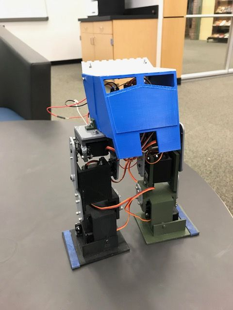
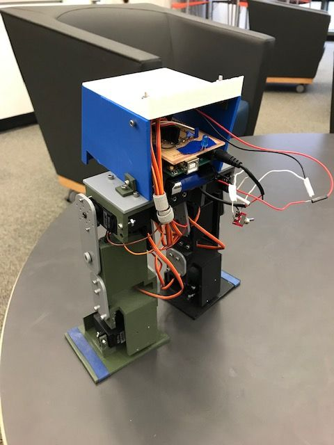

# BEARR the Bipedal robot
BEARR The Bipedal Electronic Autonomous Radical Robot. Fully self walking robot built by Max Leblang and Elijah Tolten. Below is GIF of the our robot walking!

# Plan
## Overview/Goals
Our goal for this project is to create a robot that can walk on two legs. It will have two modes that accomplish a different task. We will have to get the robot to balance by itself and take steps by itself. We decided to make ours look like an ATST from Star Wars, and play the Imperial march on a buzzer, which is super cool and impressive, and not at all annoying. We named our robot Bearr for Bipedal Electronic Autonomous Radical Robot.

## Criteria/Constraints
Criteria: Make a two-legged robot that can walk by itself.
Constraints: We can't 3D print all the pieces we would want to, due to the price, and we can only use 6 servos because the Arduino can only support that many, printing large flat pieces

## Materials
* Acrylic
* Computer
* Solidworks
* 6 180 Degree servos
* Custom 6V battery pack with AA batteries
* Screws
* Bolts
* Nuts
* Standoffs
* Arduino
* Wires
* 3D printed parts
* Switch
* Custom PCB
* LED

# Final Product
 

## Reflection
We are very happy to have completed BEARR the Biped, and we are very pleased at how it turned out. Not only was it the first fully walking biped out of the sigma lab, but it was the first completed project to use a PCB, which was really fun and helpful to make. We have learned a ton from working on this project for the past three months like how to design something with a central COG, how useful PCB boards are and how to use them, and how to thread multiple motions in arduino. Some challenges that we had were getting the COG over the legs, finding the best way to power the arduino and six servos, and programming in each and every servo position for the smoothest and best possible walk. We definitely felt like we wanted to give up at some points, especially when the robot kept falling over and we couldn't figure out why; however, we powered through, worked hard, restarted some things, and now we're finally done. Enjoy BEARR!
